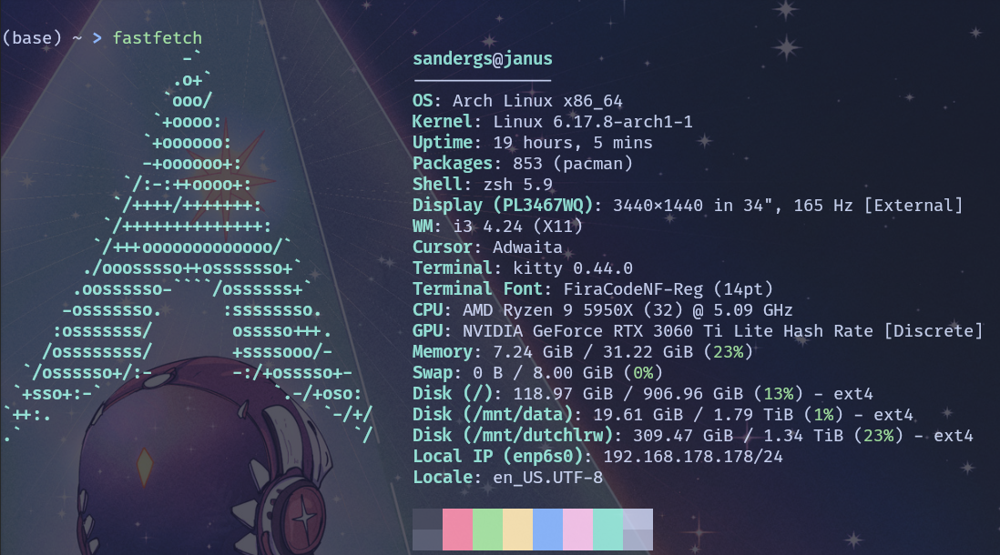

# dotfiles - workstation

## System info

## Description

Configuration files and scripts for my workstation setup, providing an almost mouseless development environment.

**Operating System:** [arch linux](https://archlinux.org/)
**shell:** [zsh](https://wiki.archlinux.org/title/Zsh)
**Display server:** [X11](https://wiki.archlinux.org/title/Xorg)
**Display Compositor:** [picom](https://wiki.archlinux.org/title/Picom)
**Tiling Window Manager:** [i3](https://wiki.archlinux.org/title/I3)
**Status Bar:**

- [polybar](https://wiki.archlinux.org/title/Polybar)
  **Terminal Emulators:**
- [kitty](https://wiki.archlinux.org/title/Kitty)
- [Ghostty](https://wiki.archlinux.org/title/Ghostty)
  **IDE:**
- [Neovim](https://wiki.archlinux.org/title/Neovim)
- [kickstart-modular.nvim](https://github.com/dam9000/kickstart-modular.nvim)
  **NVIM Plugins:**
- [nvim-tree](https://github.com/nvim-tree/nvim-tree.lua)
- [bufferline](https://github.com/akinsho/bufferline.nvim)
- [snacks (image)](https://github.com/folke/snacks.nvim)
- [none-ls](https://github.com/nvimtools/none-ls.nvim)
  **Proton Build:** [proton-ge-custom](https://github.com/GloriousEggroll/proton-ge-custom)
